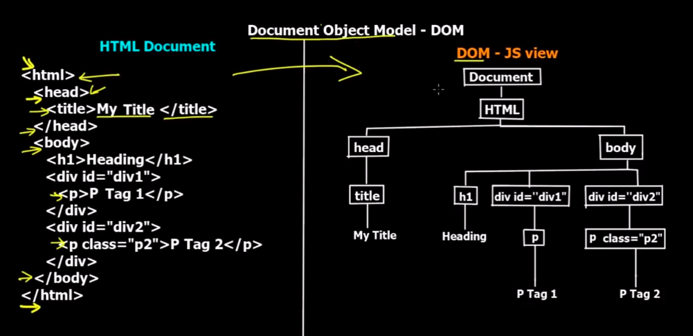

# Java Script

A website has 3 Essential Parts

1. HTML : Actual Structure of Website
2. CSS  : Adds style to the Web Page
3. JS   : Adds programming

**DOM : Document Object Model**

A tree like structure of Tags and their children root is the <html> tag.

**Note 1**

When the code is very large the JS Code is always put at the end of the File to optimize the performance as otherwise it will have to be loaded in the beginning.

**Note 2**

1. JavaScript is loosely typed Programming Language(No need to define the variable during declaration).
2. JavaScript is Dyanmically Scripted(Whatever the value we pass the type of variable changes).

**Naming Conventions**

1. Name should not be keyword.
2. First char must be a letter or '_' or '$', subsequent characters may be any letter or number.
3. Variables are case sensitive.

alert(MESSAGE); -> Gives an alert pop up.

**Operators In JavaScript**

|Operators|Descriptions|Comparing|Returns|
|:---|:---|:---|:---|
|==|equal to|x == 8|true/false|
|===|equal value and equal type|x === 5|true/false|
|!=|not equal|x != 8|true/false|
|>,<,>=,<=|||true/false|

